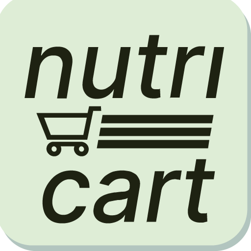
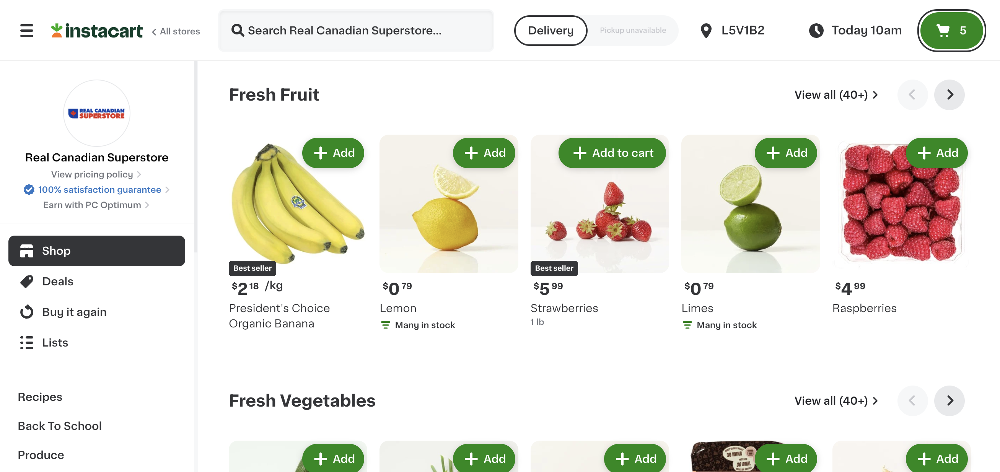
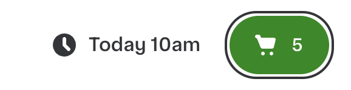
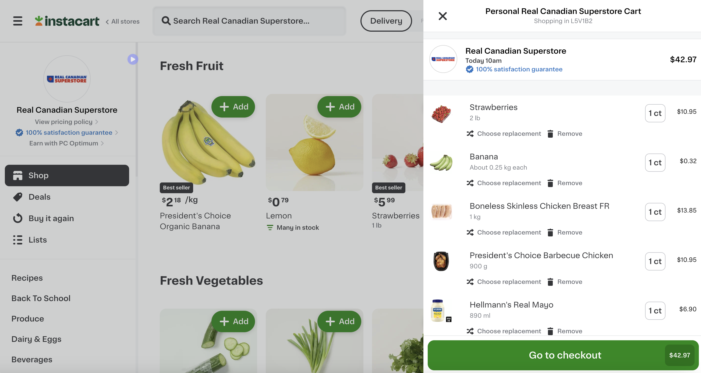
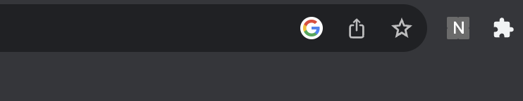
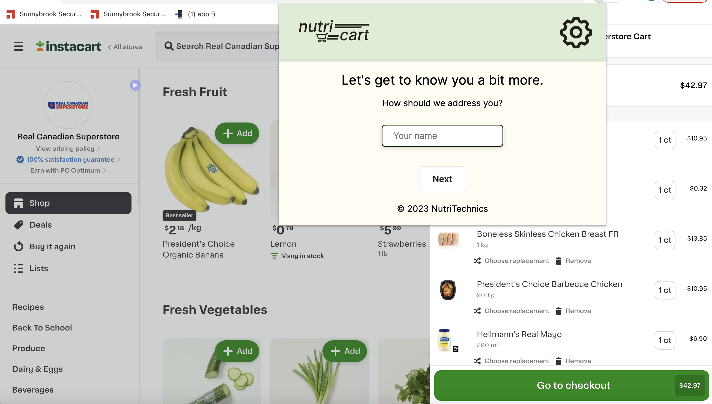
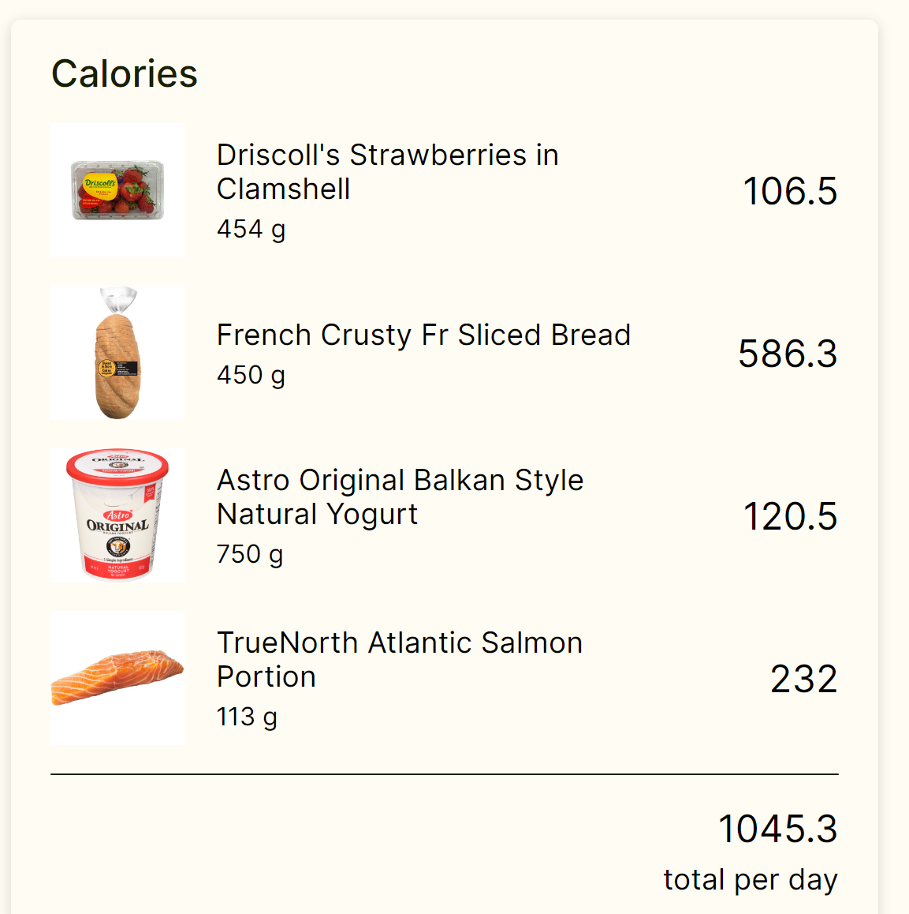
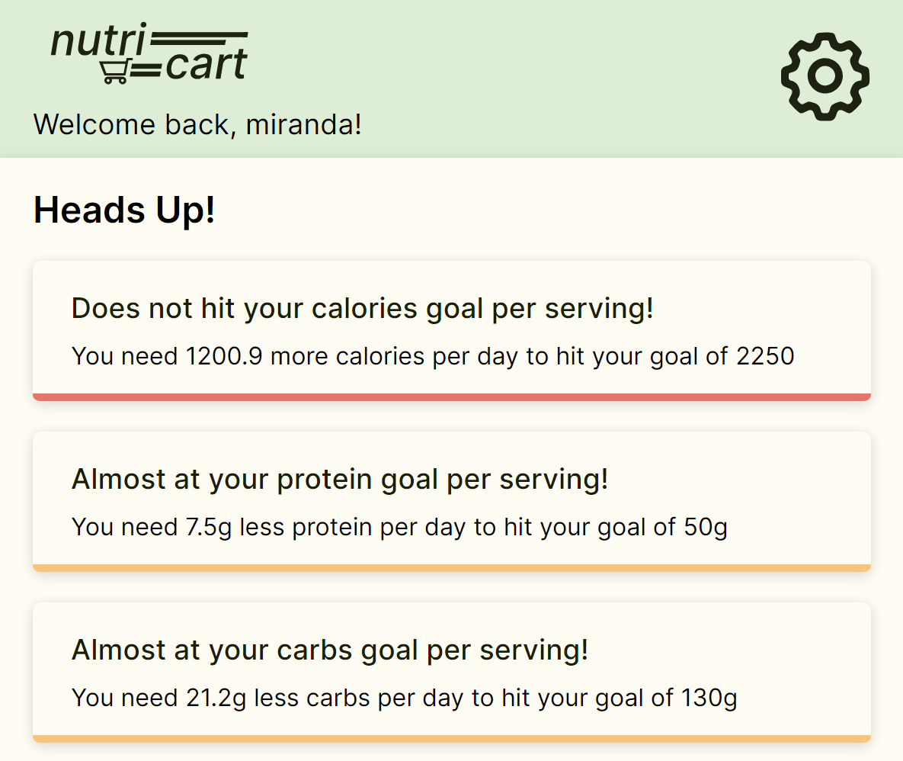
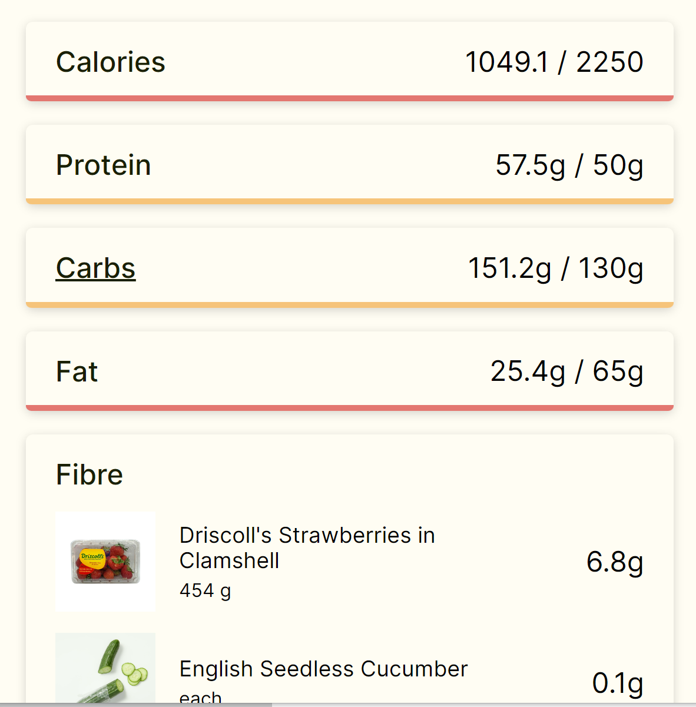

#  NutriCart

In the busy modern lives of young adults, it is not always easy or convenient to maintain a healthy and nutritious diet.


However, it is tedious and repetitive to calculate the macronutrient intake for different needs per person every meal. With the rise of online grocery shopping, we wanted to create a tool that empowers users to make informed nutritional choices effortlessly.

We introduce **NutriCart** -  your online grocery companion. Helping you balance health and convenience in every click, by seamlessly tracking calories, protein, fibre and more!
(https://www.instacart.ca/store/real-canadian-superstore/storefront).

<p align='center'>
    <br> 
</p>

To use this extension, you can simply set up your goals in the extension, and every time you checkout it will calculate whether this week's groceries is going to fulfill your target.  

<p align='center'>
    
</p>

<br>

# How to use this extension
1. Do your regular shopping in [instacart](https://www.instacart.ca/store/real-canadian-superstore/storefront)
<p align='center'><br></p>

2. When you click the chekout button, if you see the pop out checkout tab, you can now click the extension button
<p align='center'>
<br>
<br>
<br>
</p><br>

3. If this is your first time using it, you will need to set up your user information to calculate your macro nutrient need 
<p align='center'><br></p>

4. Now you should be able to see all the items in the cart and the total macro nutrients of this times' purchase
<p align='center'><br></p>
<p align='center'></p>

5. You will also see tabs that displays how much you need to add or reduce to reach your goal
<p align='center'><br></p>

<br>

# How to run this project (for developers)
1. Install the dependencies, make sure node.js and npm is installed
```
npm install 
```
2. Run the project
```
npm run build
```
3. Now go to open your Chrome browser and type `chrome://extensions/` in your search bar and turn on the developer mode
4. Click on `Load unpacked` button and select the `build` folder in the project directory
5. Now you should see the extension in your Chrome browser

